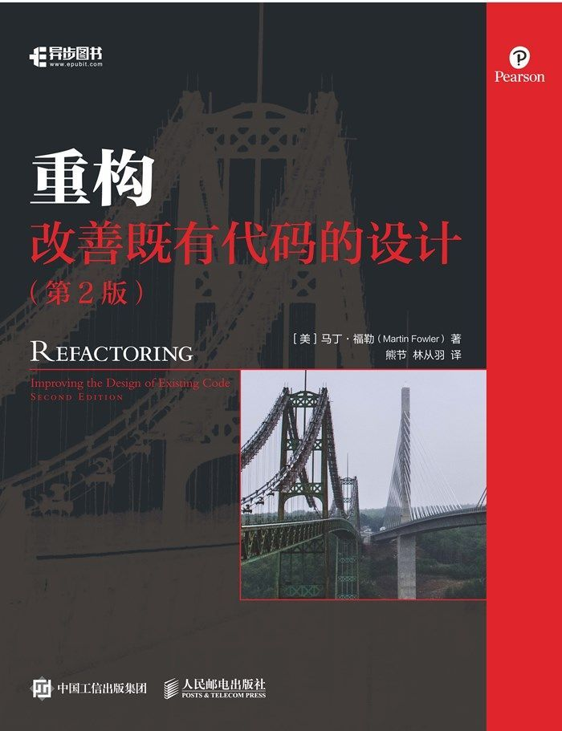

# Refactoring2-zh

《重构 改善既有代码的设计第二版》中文翻译

在线阅读：[http://gdut_yy.gitee.io/doc-refact2/](http://gdut_yy.gitee.io/doc-refact2/)

## 前言

## Index

- [第 1 章 重构，第一个示例](./docs/ch1.md)
- [第 2 章 重构的原则](./docs/ch2.md)
- [第 3 章 代码的坏味道](./docs/ch3.md)
- [第 4 章 构筑测试体系](./docs/ch4.md)
- [第 5 章 介绍重构名录](./docs/ch5.md)
- [第 6 章 第一组重构](./docs/ch6.md)
- [第 7 章 封装](./docs/ch7.md)
- [第 8 章 搬移特性](./docs/ch8.md)
- [第 9 章 重新组织数据](./docs/ch9.md)
- [第 10 章 简化条件逻辑](./docs/ch10.md)
- [第 11 章 重构 API](./docs/ch11.md)
- [第 12 章 处理继承关系](./docs/ch12.md)

## 本地开发 & 阅读

## License

[MIT](./LICENSE)
